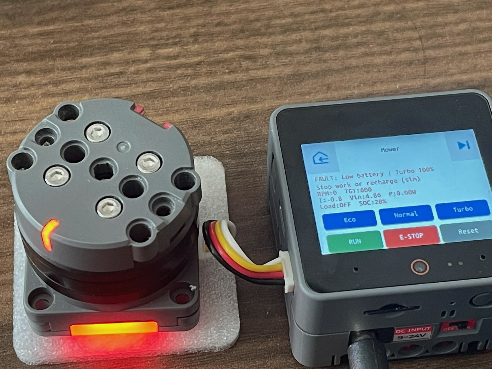
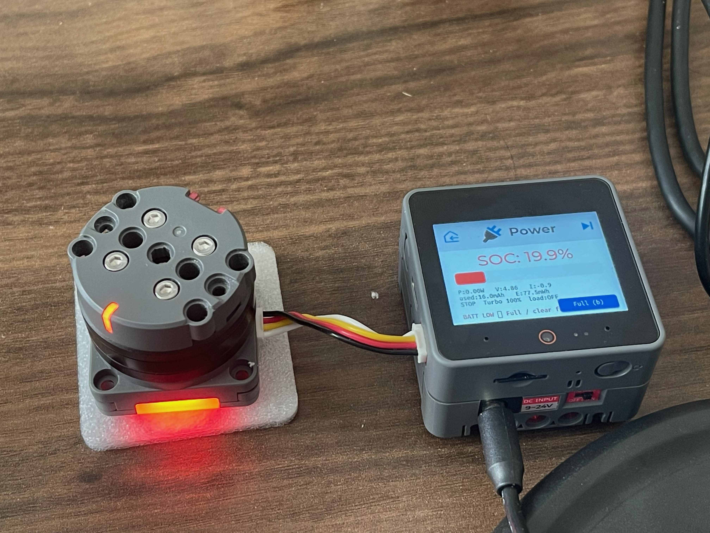
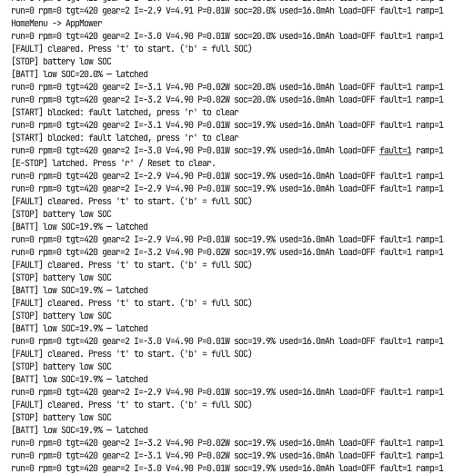
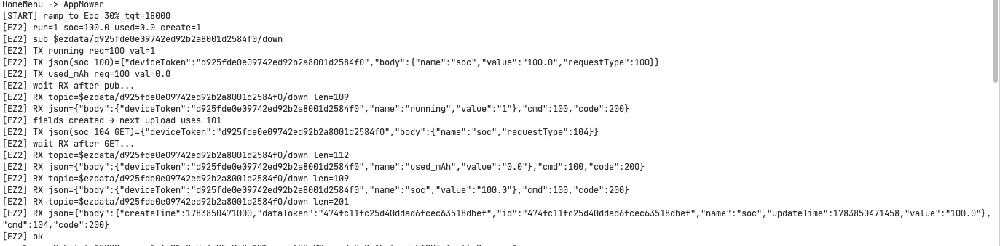
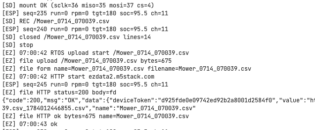
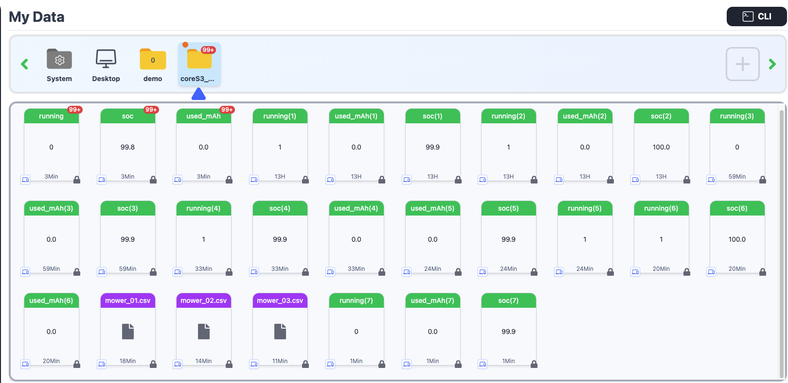
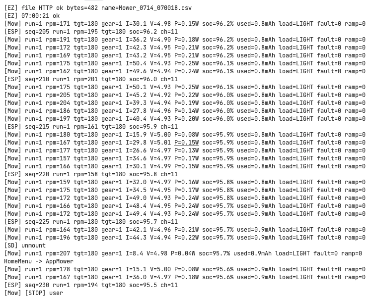

# Smart Lawn Mower

Smart Lawn Mower 是一款基于 BLDC 刀盘电机的园艺工具原型，意在模拟器具的智能逻辑。
其中，CoreS3负责闭环转速控制、负载感知、软启动与故障闩锁；本地 SD 记录运行数据，云端低频同步机队状态，并通过 ESP-NOW 无需wifi推到外接大屏。形成控制、监测与互联的完整演示。

> 主代码在 `./src`，Atom 从机在 `./src_slave/EspNow_Telem_Slave.ino`。  
> 文档分册：[`docs/README.md`](./docs/README.md) · [`docs/DEMO_feat.md`](./docs/DEMO_feat.md)

---

## 硬件

| 角色 | 硬件 | 说明 |
|------|------|------|
| 主控 | **CoreS3 Lite** | LVGL UI、高性能主控 |
| 电机 | **Unit Roller**  | 内置 FOC,支持电流、速度、位置三环控制 |
| 大屏 | **AtomS3R + Display Base** | 驱动HDMI屏展示，1280x720p@60Hz |
| 供电 | **DinBase 12V** | 插头用双线供给BLDC模组 |

## 架构

```
                       ☁️Cloud
                           |
                        CoreS3
                    /      |       \
              Unit Roller  SD    AtomS3R
                   |                |
              BLDC Motor          Screen
```

---

## 功能

| 模块 | 功能 | 要点 |
|------|------|------|
| **Mower** | 三档 / 软爬坡 / 限流 | Eco·Normal·Turbo；负载分档、软堵转；E-stop锁定 / jam锁定 / 低电锁定 |
| **AppMower** | 触控控机 | UI界面；实时信息显示；故障英文手册 |
| **Battery** | SoC估算 | 库仑计、功率积分、已用电量、低电停机 |
| **SD / CSV** | 本地记录 | 支持实时时间和日期，`t` = RTC + millis；文件预览，支持滑动；热插拔|
| **EzData2 MQTT** | 实时快照 | 每60s上传资产状态；{`running` / `soc` / `used_mAh`}；方便监控 |
| **HTTP 上传** | 工程记录 | `RTOS netWorker`；后台大文件上传，无阻塞；详细使用数据供学习用 |
| **Self-check** | 开机自检 | BLDC、WiFi、SD、IMU、Cam 连接性检测|
| **ESP-NOW** | 外接看板 | packed `EspNowTelem` ver2实现；无需wifi，无线连接，100m内稳定 |

### 串口调试

| 前缀 | 含义 |
|------|------|
| `[Mow]` | 电机业务 |
| `[SD]` | 卡相关 / CSV |
| `[EZ]` | WiFi / MQTT / HTTP |
| `[ESP]` | ESP-NOW |

---

## 关键路径

| 用途 | 路径 |
|------|------|
| 应用 | `src/pages/*` |
| 电机 | `src/motor/Mower.*` |
| 云 / 上传 | `src/cloud/EzData2Client.*`、`NetUpload.*` |
| ESPNOW | `src/cloud/EspNowTx.*`、`src_slave/*` |
| Secrets | `include/config_ezdata2_secrets.h`（gitignore） |

---

## 编译 / 烧录（主控）

```bash
cd Mower_ui
pio run -e M5CoreS3
pio run -e M5CoreS3 -t upload
```

Atom：Arduino IDE 选 **AtomS3R**，打开 `EspNow_Telem_Slave`，库需 M5Unified + M5GFX。  
信道须与 CoreS3 串口 `[ESP] … ch=N` 一致（**连 WiFi 时常为 AP 信道**）。

---

# Feature Demo

预览用：功能分节 + 截图 / 视频。

---

## 1. Mower App

#### 1.1 三档 Eco / Normal / Turbo（软爬坡）

#### 1.2 RPM vs TGT（速度闭环）

#### 1.3 故障闩锁

[](https://www.bilibili.com/video/BV1WyN966EJn/)

视频：https://www.bilibili.com/video/BV1WyN966EJn/

---

## 2. Battery / SOC

#### 2.1 电量

[](https://www.bilibili.com/video/BV1CyN966Ec7/)

视频：https://www.bilibili.com/video/BV1CyN966Ec7/

#### 2.2 低电保护





---

## 3. SD / CSV 本地记录

#### 3.1 记录和预览

#### 3.2 日志落盘

同 [2.1 电量](#21-电量) 视频：https://www.bilibili.com/video/BV1CyN966Ec7/

---

## 4. Device Self-check

#### 4.1 设备自检

[](https://www.bilibili.com/video/BV1AyN966EGd/)

视频：https://www.bilibili.com/video/BV1AyN966EGd/

---

## 5. 外接大屏（ESP-NOW）

#### 5.1 实时看板（RPM / TGT / 功率 / SOC）

#### 5.2 与主控状态同步

[](https://www.bilibili.com/video/BV1AyN966Emk/)

视频：https://www.bilibili.com/video/BV1AyN966Emk/

---

## 6. 云端（EzData2）

#### 6.1 MQTT 机队快照



#### 6.2 CSV 文件上传



#### 6.3 云端储存



---

## 7. 系统与调试

#### 7.1 串口日志



## TODO:
1, 界限：增加与实际刀片的理解（功率10～20倍之差，BLDC模组无法实现，只模拟智能逻辑）  

2，对BLDC(恒速控制,变换，开/闭环架构，模组源码)的理解。  

3，文档+草稿整理：前期规划，开发日程等等。
